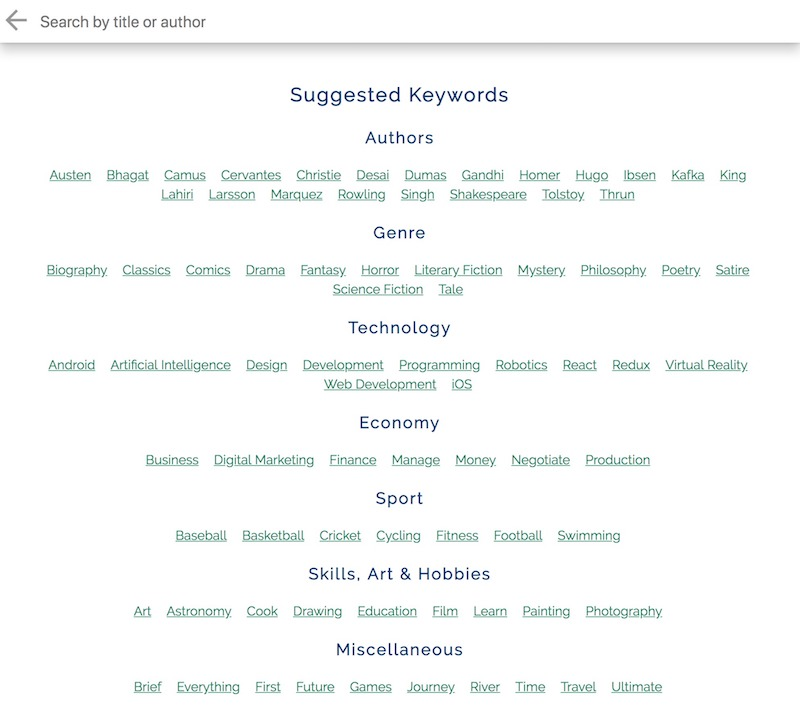

# MyReads React App

## Project Description

This MyReads App is a project made with React for the completion of the [Udacity's Front-End Web Developer Nanodegree](https://www.udacity.com/course/front-end-web-developer-nanodegree--nd001?v=fe1).

## Instructions

Create a book tracking app with React that allows users to search and categorize books that they are reading, want to read, or have already read. The API server and client library have already been provided. The main task of this project was to implement full functionality to the app, which includes routing, searching for new books using select keywords, browsing books information, moving books into 3 custom libraries, and keeping the data updated in both the app and the server.

## How to start

1. Clone or download the repository;

2. In the terminal, cd into the root folder, and input the command `$ npm install` to install the dependencies.

3. Type `$ npm start`. The app will open in the browser automatically.

## Project overview

### MyBooks page

The initial page consists in 3 shelves called "Currently reading", "Want to read", and "Read". Each shelf displays various books previously selected by the user, with the total of books currently stored in that shelf printed next to the name of the shelf. Each shelf can be cleared instantaneously by clicking on "Clear this shelf". In case there is no book in that shelf, a message will appear, prompting the user to add more books through the Search Page.

From this page, as for any other page of this app, it is possible to change the shelf of the book by clicking on the selector on the bottom right corner of the book cover. The book will be immediately displayed in the new shelf, disappearing from the old one. It is also possible to set the shelf value to "None" to remove the book from the MyBooks page.

### Search page

To find more books, the user can click on the "+" button on the bottom right corner of the main page. Doing so will display a new page containing a search bar. It is possible to either type a query, or select one of the keywords suggested below (which are by default the only ones that can be used to get some results). Either way, as soon as the search bar has some content, a maximum of 20 matching books are displaying. By clicking on "Reset Search", it is possible to delete the content of the search bar and perform a new search.

### Book details

By clicking on the books title, either from the MyBooks page or from the Search page, users can access a page that displays more detailed information about the book selected, if present (rating, category, language, pages, publisher, publication date, and overview), plus a link to an external webpage. By clickin on the "x" button on the top right corner, or by clicking on the title on the top bar, it is possible to close this page and return to the MyBook page.

## Dependencies:

- [React](https://reactjs.org/)
- [react-router-dom](https://github.com/ReactTraining/react-router/tree/master/packages/react-router-dom)
- [prop-types](https://www.npmjs.com/package/prop-types)
- Icons: [https://www.materialui.co/](https://www.materialui.co/)
